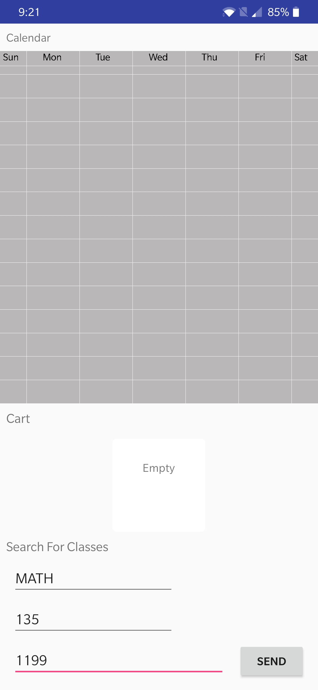
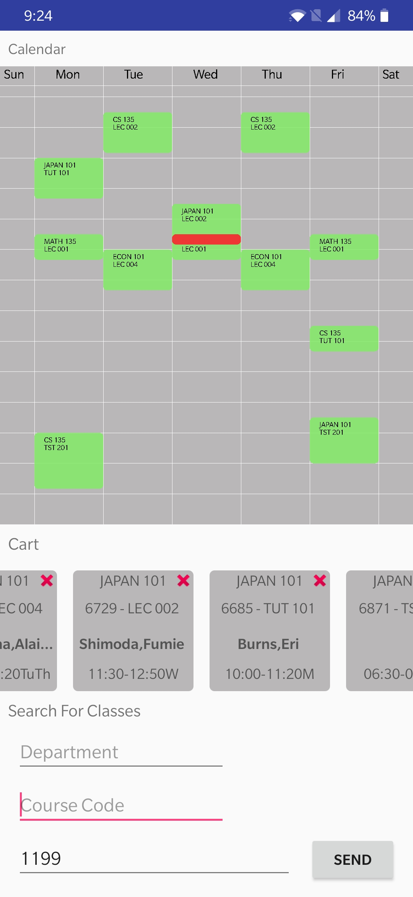

# UWCoursePlanner

University of Waterloo week course planner. Pulls info by webscraping from the university website.

VISUALS UNFINISHED, core functionality complete

### Screenshots for Shopify 
Initial empty screen

---
Courses search result screen, TODO add class location to layout and listview adapter

---
Courses in cart and added to calendar screen

---
Time conflict screen

