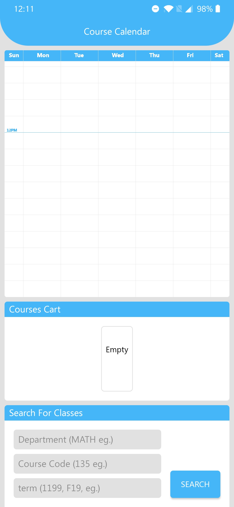
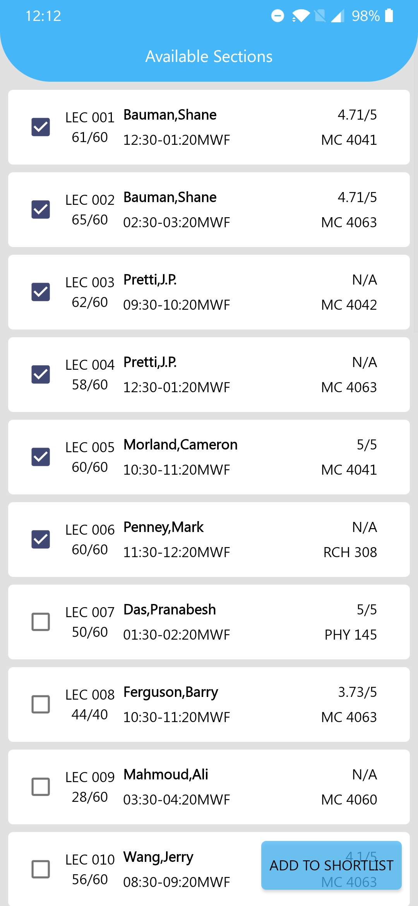
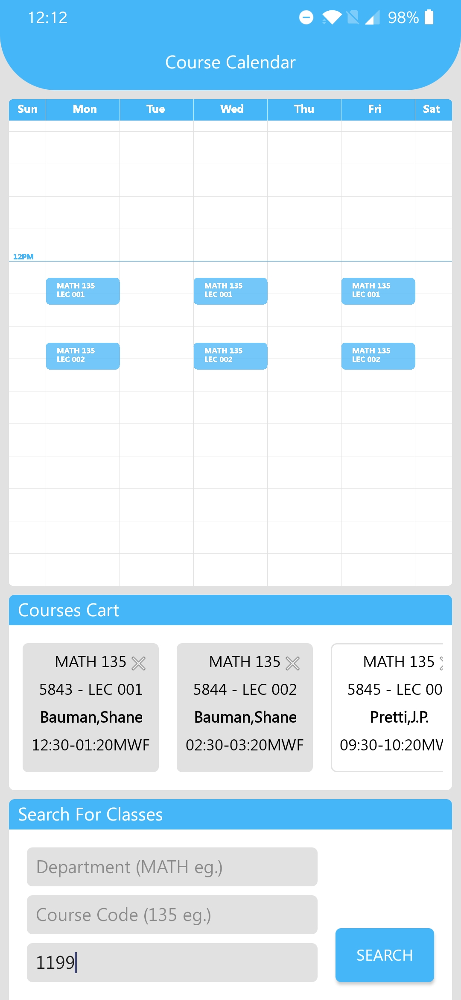
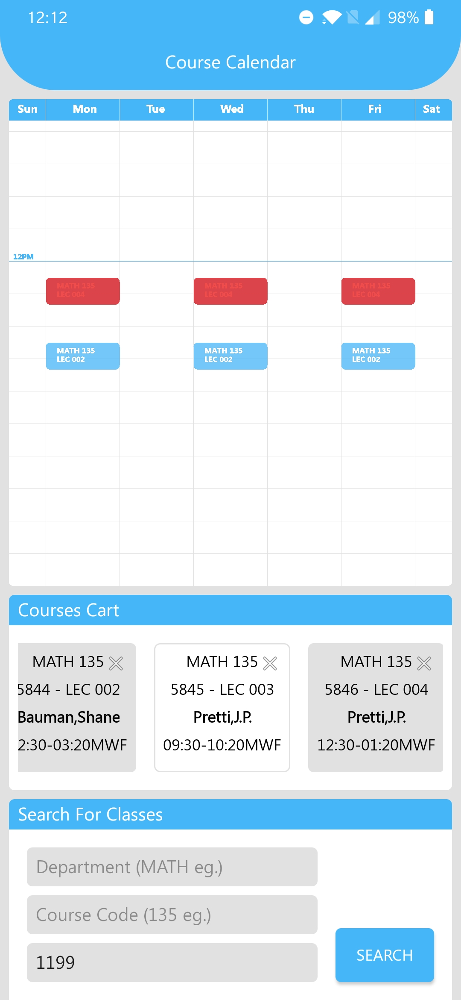

# UWCoursePlanner

University of Waterloo week course planner. Pulls info by webscraping from the university website. HTML data organized with JSoup. Written in 5 days, old work was mostly scrapped in Java -> Kotlin conversion

Section data scraped from registrar website: http://www.adm.uwaterloo.ca/cgi-bin/cgiwrap/infocour/salook.pl?level=under&sess=1199&subject=MATH&cournum=135

Prof ratings scraped from rate my prof: https://www.ratemyprofessors.com/ShowRatings.jsp?tid=2047091

Puhlished to the Play Store: play.google.com/store/apps/details?id=cah593wang.uwaterloo.cs.student.httpswww.uwcourse

### Screenshots for Shopify 

Demo flow Gif (Screenshots below)

Updated Screenshots coming

Initial empty screen

---
Courses search result screen, course data and prof ratings are webscraped

---
Courses in cart and added to calendar screen

---
Courses added to calendar and time conflict screen

